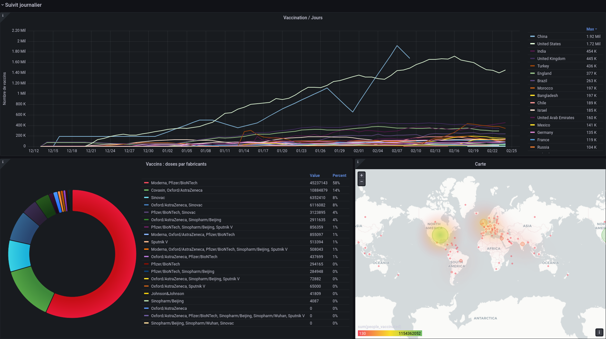

# Un tableau de bord sur la Covid

Utiliser un conteneur Grafana, grâce à Docker, pour faire de la Dataviz.

## Contexte du projet

Afin de préparer une stack facilement déployable pour l'équipe de dev, les analystes data et le client, votre chef de projet vous demande de préparer des conteneurs pour des outils de Dataviz.

Après discution avec la haute autorité de santé, votre client, les technologies retenues sont MySQL et GRAFANA.

Le serveur est en Linux.

## Modalités pédagogiques

Vous avez 2 jours pour préparer les conteneurs et le dashborad qui affichera au moins 2 graph obtenus à partir de la base de donnée MySQL, dans laquelle 

vous aurez intégré les données sur la vacination mondial du COVID-19.

Le travail se fait en binôme.

Vous devez tester vos conteneurs dans un environnement Linux, soit sur un OS, soit sur WSL.

Avant de réaliser votre capture d'écran, vous présenterez vos travaux au formateur pour qu'il valide le dashboard.

## Critères de performance

- Les conteneurs doivent tourner sur Linux.
- Le README doit permettre de reproduire toutes vos manipulations.
- Le dashboard doit contenir au moins 2 graph et vous devez respecter les technologies demandées

## Modalités d'évaluation

Evaluation par le formateur.

## Livrables

Le livrable est un lien vers un dépôt GitHub qui contient, OBLIGATOIREMENT :
- [X] une capture d'écran du dashborad GRAFANA,
- [X] le docker compose de la stack,
- [~] un README très détaillé du travail fait pour obtenir le dashboard (en Markdown)

